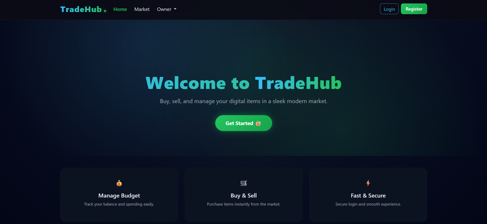
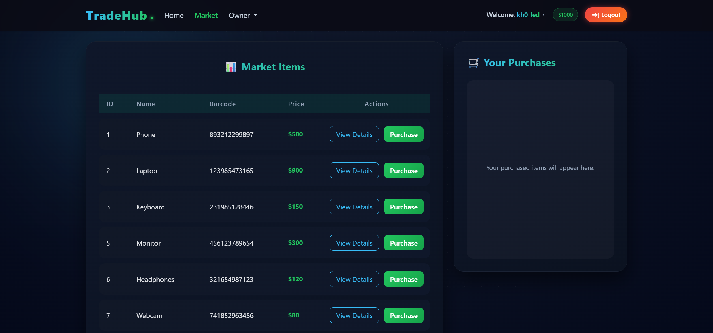
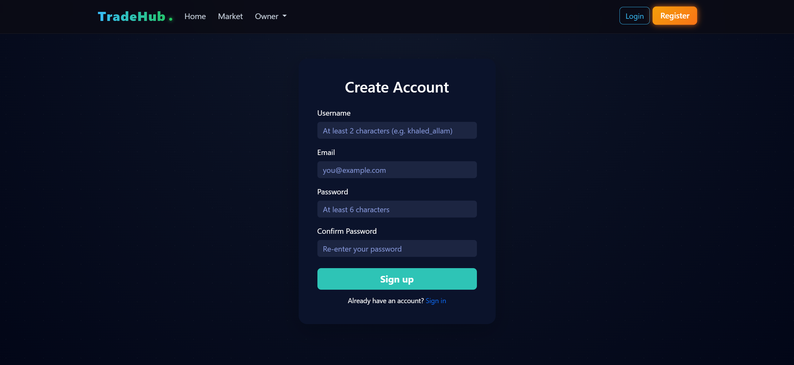
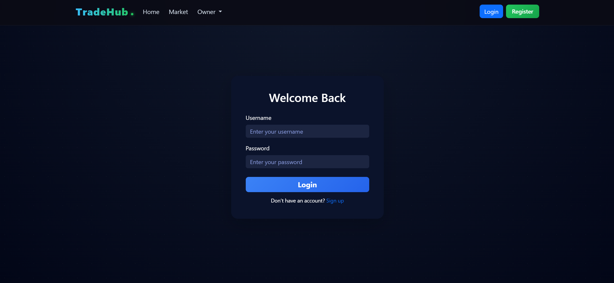
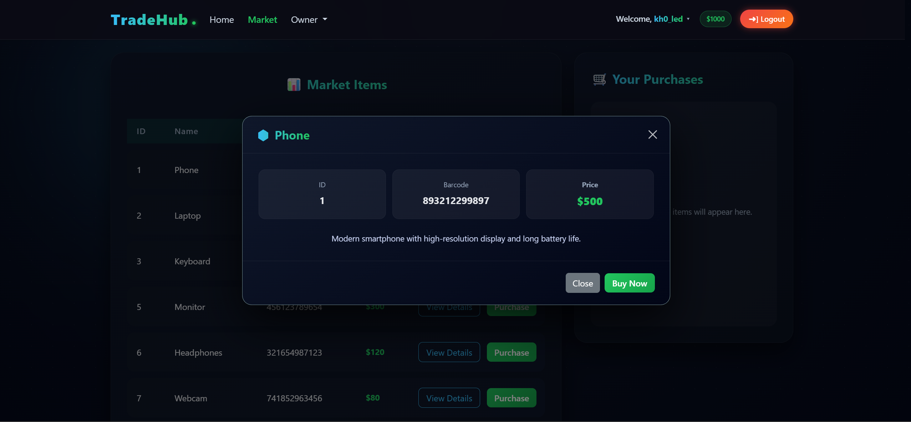
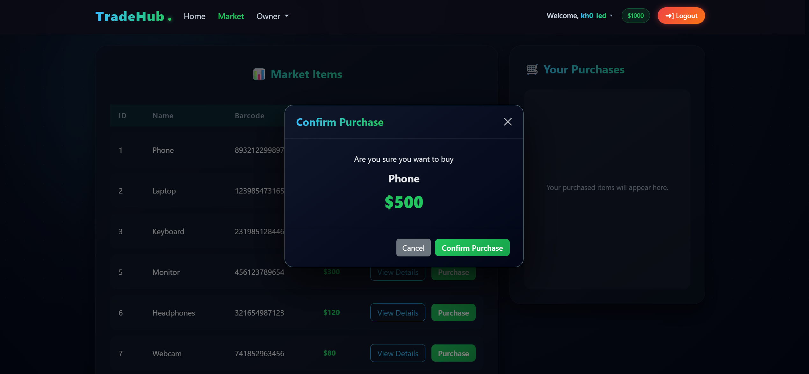
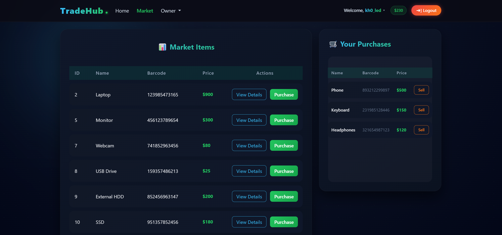
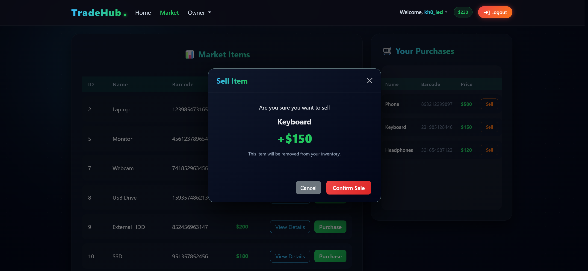
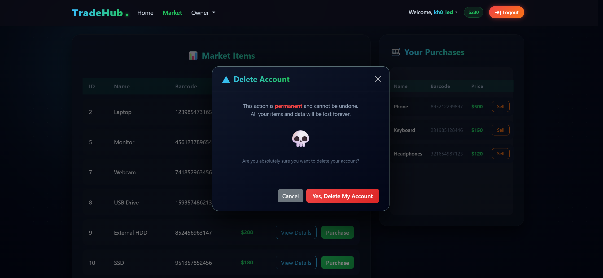

<div align="center">

<!-- Animated Banner -->


<br/>

<!-- Badges -->
<!-- Language & Frontend -->


<!-- Backend & Database -->


<!-- Flask Extensions -->


<!-- Meta -->


<br/>

> **TradeHub** is a full-stack marketplace web app where users can register, log in, buy & sell items with real budget logic — if you own it, no one else can buy it until you sell it back.

<br/>

[✨ Features](#-features) • [🖼 Screenshots](#-screenshots) • [⚙ Tech Stack](#-tech-stack) • [🚀 Installation](#-installation) • [💡 How It Works](#-how-it-works) • [🔮 Roadmap](#-roadmap)

</div>

---

## ✨ Features

<table>
<tr>
<td width="50%">

### 🔐 Auth System

- ✅ User Registration
- ✅ Secure Login & Logout
- ✅ Session Management via Flask-Login
- ✅ Password hashing

</td>
<td width="50%">

### 🛒 Marketplace

- ✅ Browse all available items
- ✅ Buy items — instantly removed from market
- ✅ Sell items back — returns to market
- ✅ Real-time budget updates

</td>
</tr>
<tr>
<td width="50%">

### 💰 Budget Logic

- ✅ Every user starts with **$1,000** default balance
- ✅ Buying deducts from balance
- ✅ Selling adds back to balance
- ✅ Can't buy what you can't afford

</td>
<td width="50%">

### 🗑 Account Management

- ✅ Delete account with confirmation modal
- ✅ All owned items returned to market on deletion
- ✅ Instant session termination
- ✅ Flash notification system

</td>
</tr>
</table>

---

## 🎯 The Core Mechanic

```
User buys item  →  Item LOCKED to that user  →  No one else can buy it
User sells item →  Item RELEASED back to market →  Anyone can buy it again
```

> This creates a real ownership system. Items aren't infinite — supply is limited.

---

## 🖼 Screenshots

> 📸 _Add your screenshots to a `/screenshots` folder and update paths below_

| Home                          | Market                            | Modals                          |
| ----------------------------- | --------------------------------- | ------------------------------- |
|  |  |  |

---

## 🖼 Screenshots

| Page              | Preview                                        |
| ----------------- | ---------------------------------------------- |
| 🏠 Home           |                   |
| 📝 Register       |           |
| 🔐 Login          |                 |
| 🛒 Market         |               |
| 🔍 Item Details   |  |
| 💸 Buy Item       |         |
| 📦 Owned Items    |     |
| 💵 Sell Item      |       |
| ❌ Delete Account |   |

---

## 📂 Project Structure

```
tradehub/
│
├── app/
│   ├── static/
│   │   └── css/
│   │       └── style.css                   # Custom styles, glassmorphism, gradients
│   │
│   ├── templates/
│   │   ├── includes/
│   │   │   ├── market_items_modals.html    # Buy & details modals for each item
│   │   │   └── owned_items_modal.html      # Sell modals for owned items
│   │   │
│   │   ├── base.html                       # Base layout (navbar, flash messages)
│   │   ├── home.html                       # Landing page
│   │   ├── login.html                      # Login form
│   │   ├── register.html                   # Register form
│   │   └── market.html                     # Marketplace (buy/sell/owned items)
│   │
│   ├── __init__.py                         # App factory, DB init
│   ├── forms.py                            # WTForms (Register, Login, Market)
│   ├── models.py                           # User & Item models
│   └── routes.py                           # All application routes
│
├── config/
│   ├── .env                                # Secret keys (not committed)
│   └── .env.example                        # Template for environment setup
│
├── instance/
│   └── market.db                           # SQLite database (auto-generated)(not committed)
│
├── screenshots/                            # App screenshots for README
│   ├── home.png
│   ├── register.png
│   ├── login.png
│   ├── market.png
│   ├── show_details_modal.png
│   ├── buy_modal.png
│   ├── owned_items.png
│   ├── sell_modal.png
│   └── delete_modal.png
│
├── .gitignore
├── LICENSE
├── README.md
├── requirements.txt
└── run.py                                  # Entry point
```

---

## ⚙ Tech Stack

| Layer         | Technology                             | Version        |
| ------------- | -------------------------------------- | -------------- |
| **Language**  | Python                                 | 3.11.0         |
| **Framework** | Flask                                  | 3.1.2          |
| **ORM**       | Flask-SQLAlchemy + SQLAlchemy          | 3.1.1 + 2.0.46 |
| **Auth**      | Flask-Login + Flask-Bcrypt             | 0.6.3 + 1.0.1  |
| **Forms**     | Flask-WTF + WTForms                    | 1.2.2 + 3.2.1  |
| **Config**    | python-dotenv                          | 1.2.1          |
| **Database**  | SQLite                                 | —              |
| **Frontend**  | Bootstrap 5 + Custom CSS               | 5.x            |
| **Icons**     | Bootstrap Icons                        | —              |
| **Styling**   | Glassmorphism + Gradients + Animations | —              |

---

## 💡 How It Works

### 💸 Buying an Item

```
1. User clicks "Purchase"
2. Modal pops up showing item name + price
3. Form submits to POST /market
4. Server checks: user.budget >= item.price
5. If affordable:
      item.owner = current_user.id
      current_user.budget -= item.price
      db.session.commit()
6. Item DISAPPEARS from the public market
7. Item APPEARS in user's owned items
```

### 💵 Selling an Item

```
1. User clicks "Sell" on owned item
2. Modal confirms the sale
3. Form submits to POST /market (sell action)
4. Server:
      item.owner = None
      current_user.budget += item.price
      db.session.commit()
5. Item REAPPEARS on public market
6. Budget INCREASES instantly
```

---

## 🚀 Installation

### 1. Clone the repo

```bash
git clone https://github.com/khaledelsayed2003/tradehub-marketplace.git
cd tradehub
```

### 2. Create & activate virtual environment

```bash
# Create
python -m venv .venv

# Activate (Windows)
.venv\Scripts\activate

# Activate (Mac/Linux)
source .venv/bin/activate
```

### 3. Install dependencies

```bash
pip install -r requirements.txt
```

### 4. Set up environment variables

```bash
cp config/.env.example config/.env
# Then edit config/.env and add your SECRET_KEY
```

### 5. Run the app

```bash
python run.py
```

> 🌐 App will run at: `http://127.0.0.1:5000`

---

## 🧪 Try It Out

| Action                 | What Happens                               |
| ---------------------- | ------------------------------------------ |
| Register a new account | Get $1,000 starting budget                 |
| Buy an item            | It's removed from market, budget drops     |
| Check market           | That item is GONE for everyone             |
| Sell it back           | Item returns to market, you get money back |
| Delete account         | Everything wiped, session ends             |

---

## 🔮 Roadmap

- [ ] 🖼 Item images
- [ ] 📜 Transaction history
- [ ] 🔍 Search & filter market
- [ ] 📄 Pagination for large inventories
- [ ] 👤 User profile pages
- [ ] 🛡 Admin dashboard
- [ ] 🌙 Dark / Light theme toggle
- [ ] 💳 Stripe payment integration
- [ ] 🔗 REST API

---

## 🧑‍💻 Author

<div align="center">

**Khaled Elsayed**

[](https://github.com/khaledelsayed2003)
[](https://www.linkedin.com/in/khaledelsayed2003/)

</div>

---

<div align="center">

### ⭐ If you found this project useful, give it a star!

_It helps others discover the project and motivates continued development._


</div>
